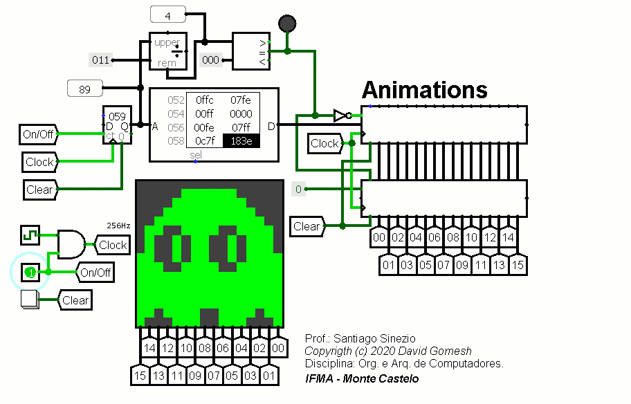
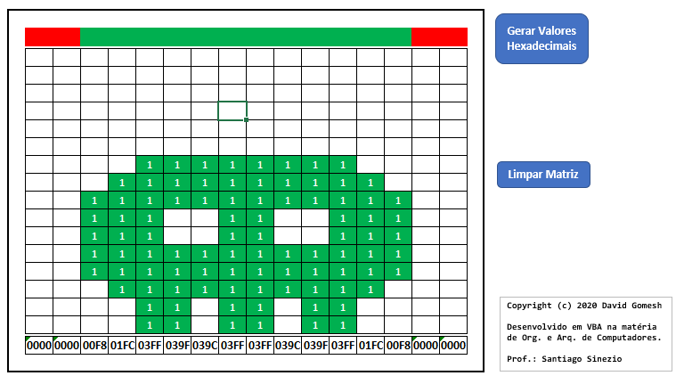
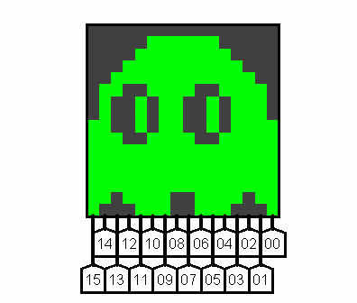
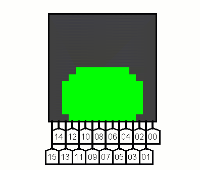

# Animations

## Sobre o Projeto

- Aluno: **David Gomesh**
- Professor: **Santiago Sinezio**
- Curso: **Sistemas de Informação**
- Disciplina: **Organização e Arquitetura de Computadores**
- Instituição: **IFMA - Monte Castelo**

Circuito para reproduzir animações no Logisim.

## Exemplo de animação

|  |
| - |
| *Exemplo de animação sendo exibida no circuito* |

## Gerando novas animações

Na pasta **Gerador HEX** foi disponibilizado uma planilha (feita no Excel), que possibilita facilmente a criação de novas animações para o circuito.

|  |
| - |
| *Gerador de novas animações* |

O botão **"Gerar Valores Hexadecimais"** foi programado usando a Linguagem VBA (Visual Basic for Applications). O código fonte está disponível na planilha, devendo ser habilitado no momento em que se inicia a mesma. Também foi disponibilizado o código separado na pasta da planilha.

## Animações Disponíveis

|  |  |
| - | - |
| *Animação do Fantasma do Pac-Man* | *Animação do Robô Ant* |

**Obs.:** no nome do arquivo está um número que correspondem ao tamanho necessário na memória ROM e no contador para que a animação seja executada.
